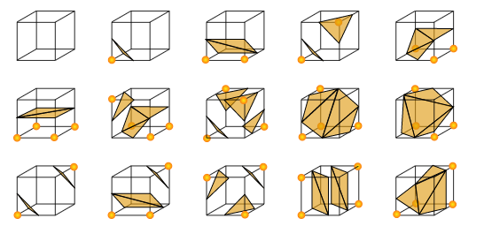
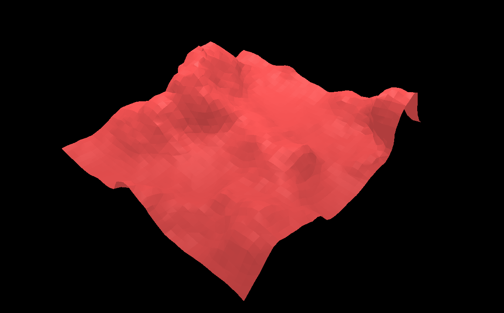
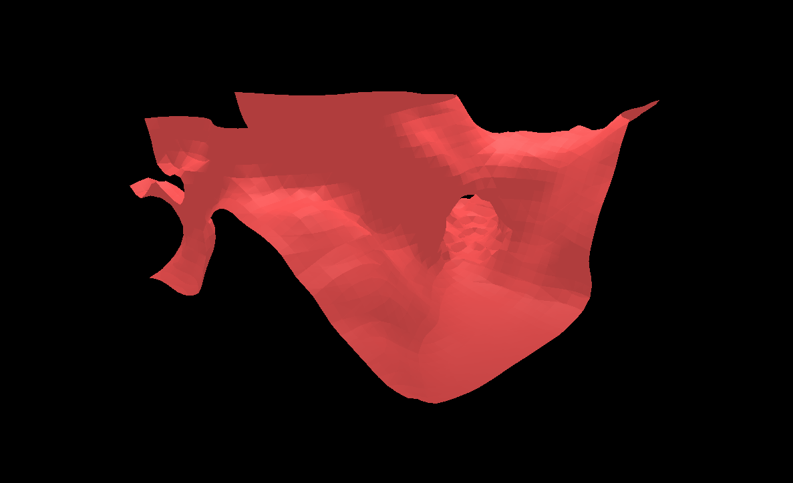

# Marching Cubes

Este proyecto experimental tiene como fin poner en práctica el algoritmo de *Marching Cubes*. Para más información de esto puede visitar [acá](https://en.wikipedia.org/wiki/Marching_cubes). Esta idea estuvo principalmente inspirada en el video [Coding Adventure: Marching Cubes](https://www.youtube.com/watch?v=M3iI2l0ltbE) de [Sebastián Lague](https://www.youtube.com/channel/UCmtyQOKKmrMVaKuRXz02jbQ). En este video se puede apreciar visualmente lo que resumidamente voy a proceder a explicar a continuación.

**Aclaración**: Si bien el autor de ese video provee el código fuente, está echo en C# para Unity y para este proyecto se realizó de cero para implementarlo con ThreeJs.

## Breve Explicación

Básicamente es un algoritmo para representar en un cuerpo tridimensional una matriz 3D. A partir de analizar 8 vértices por vez, recorriendo toda la matriz, se van construyendo polígonos en su lugar correspondiente.

Esta clasificación de 15 combinación (cabe aclarar que son más pero son simétricas o congruentes) se determina en función de si cada nodo se lo considera *activo* (representado por el círculo naranja en la imágen de referencia) y para esto el valor del mismo en la matriz debe superar una *superficie* o como se llama convencionalmente *isoSurface*.

Para lograr cuerpos más suaves adicionalmente se empleó una *interpolación* que lo que hace es dibujar los vertices, en vez de estar en el punto medio de los dos nodos, en un punto entre los dos proporcional a la diferencia de valores de los estos nodos.

## Terreno Procedural

Si bien Marching Cubes es muy interesante de por sí, sólo representa matrices. Entonces para demostrar su utilidad en este proyecto decidí mostrar un terreno generado proceduralmente, es decir, que se lo calcula a partir de valores aleatorios restringidos.

En este caso se forma a partir de un uso combinado de *Perlin Noise* en 2D y 3D. El Perlín noise genera una matriz de valores aleatorios, pero que los valores son parecidos entre nodos cercanos. En otras palabras, genera un relieve más natural que si fuesen todos valores aleatorios, ya que hay picos y valles con valores intermedios.

Entonces tomando esos valores en un mapa 2D y tomando cada valor como una altura, obtenemos un relieve básico. 

Pero solamente de esta forma se super liso y poco interesante. Para ello usamos más matrices 2D superpuestos uno encima de otro, pero cada uno con una "intensidad" menor, lo cual hace que el terreno sea menos liso con más imperfecciones, que lo hace más real.

Finalmente incorportando valores de una matriz 3D pero con menor intensidad, se generan imperfecciones como salientes en valles, o huecos que se asemejan a cuevas.

La aplicación te permite manipular valores para variar el resultado y visualizar los cambios. 

   *(El primero es para el algoritmo de Marching Cubes)*

   - **IsoSurface**: Umbral (o *treshhold*) que debe superar el valor en la matriz para que sea un nodo *activo*.

   - **Persistance**: Cantidad que afecta los valores del mapa 2D de Perlin Noise sobre sus capas
   - **Lacunarity**: Cantidad que disminuyen los detalles de los diferentes valores de perlin noise
   - **Scale**: Tamaño de los valores 2D
   - **Presence**: Presencia de los valores 3D
   - **Brush**: De este depende si el editor de terreno **añade** (1) o **substrae** (-1) volumen.
   - **Radius**: Radio del editor de terreno

## Editor de Terreno

Mas allá de las ventajas de *performance* del algoritmo, su principal beneficio es su capacidad de modificar los valores de la matriz de forma matemática y re evaluar los vértices. Esto lo especialmente útil en videojuegos con alta modificación del terreno.

## Imágenes

-----------

## Inicialización

1. Cloná este repo en algún directorio local ejecutando `git clone https://github.com/manu4gmz/marching-cubes.git`.
2. Abrí esa carpeta con el exlorador de archivos y abrí con Chrome (u otro navegador, pero este proyecto fue desarrollado en ese) el archivo `index.html`.
3. En la aplicación haz zoom hacia afuera (scroll hacia abajo) hasta visualizar el objeto.

## Controles

- **Scroll**: Zoom hacia dentro y fuera
- **Click Izquierdo y arrastrar**: Orbitar la escena (girarla)
- **Click Derecho y arrastrar**: Desplazarse
- **Click sobre el terreno**: Modificar el volumen del mismo
